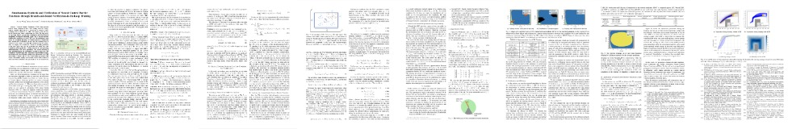
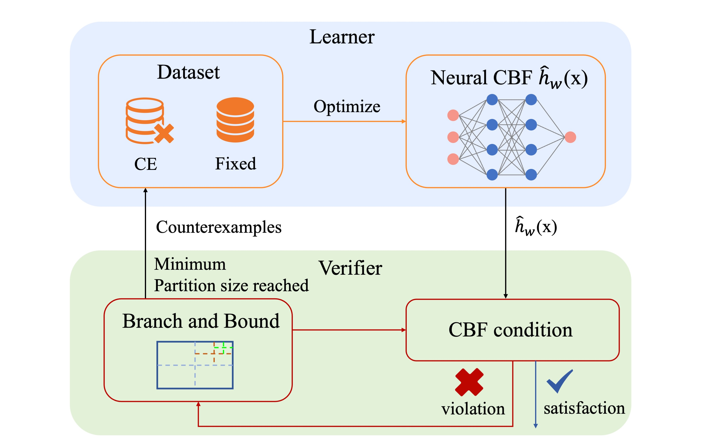

# Simultaneous Synthesis and Verification of Neural Control Barrier Functions

Implementation of the Branch-and-Bound Verification-in-the-Loop Training (BBVT) scheme for Neural Control Barrier Functions, as presented in our ECC 2024 paper titled "Simultaneous Synthesis and Verification of Neural Control Barrier Functions through Branch-and-Bound Verification-in-the-Loop Training"

[](https://arxiv.org/pdf/2311.10438.pdf)

Control Barrier Functions (CBFs) that provide formal safety guarantees have been widely used for safetycritical systems. However, it is non-trivial to design a CBF. Utilizing neural networks as CBFs has shown great success,
but it necessitates their certification as CBFs. In this work, we leverage bound propagation techniques and the Branchand-Bound scheme to efficiently verify that a neural network satisfies the conditions to be a CBF over the continuous state space. To accelerate training, we further present a framework that embeds the verification scheme into the training loop to synthesize and verify a neural CBF simultaneously. In particular, we employ the verification scheme to identify partitions of the state space that are not guaranteed to satisfy the CBF conditions and expand the training dataset by incorporating additional data from these partitions. The neural network is then optimized using the augmented dataset to meet the CBF conditions. We show that for a non-linear control-affine system, our framework can efficiently certify a neural network as a CBF and render a larger safe set than state-of-the-art neural CBF works. We further employ our learned neural CBF to derive a safe controller to illustrate the practical use of our framework.


## Install

#### Install Anaconda and Poetry
Please find instructions on their websites: [Anaconda](https://www.anaconda.com/) and [Poetry](https://python-poetry.org/).

#### Create a conda environment
```bash
conda create --name <your_env_name> python=3.8

conda activate <your_env_name>
```

#### Install this repo and dependencies

```bash
git clone https://github.com/tud-amr/ncbf-simultaneous-synthesis-and-verification.git

cd ncbf-simultaneous-synthesis-and-verification

poetry install
```

## Replicate 

### Inverted Pendulum
0. Configuration

    The configuration files are in *safe_rl_cbf/Configure*

1. Train nCBF

    ```bash
    python3 safe_rl_cbf/main/train_model.py --config_file inverted_pendulum.json
    ```

2. Test nCBF (replicate Fig. 4 )

    ```bash
    python3 safe_rl_cbf/main/test_model.py --config_file inverted_pendulum.json
    ```

    Figures can be found in *logs/CBF_logs/\<prefix\>/fig*

3. Safe Learning 

    Training
    ```bash
    python3 safe_rl_cbf/RL/main/train_model.py --config_file inverted_pendulum.json
    ```

    Visualization
    ```bash
    python3 safe_rl_cbf/RL/main/test_model.py --config_file inverted_pendulum.json
    ```

### 2D Navigation

1. Train nCBF

    ```bash
    python3 safe_rl_cbf/main/train_model.py --config_file point_robot.json
    ```

2. Test nCBF (replicate Fig. 6d)

    ```bash
    python3 safe_rl_cbf/main/test_model.py --config_file point_robot.json
    ```

3. Safe Learning (replicate Fig. 6a and Fig. 6b)

    Training
    ```bash
    python3 safe_rl_cbf/RL/main/train_model.py --config_file point_robot.json
    ```

    Visualization
    ```bash
    python3 safe_rl_cbf/Analysis/draw_training_trajectory.py

    python3 safe_rl_cbf/RL/main/test_model.py --config_file point_robot.json
    ```

## Understand Our Code
The structure of the code is similar to our system diagram. see following picture:

<div style="text-align:center;">

</div>

1. BBVT
  
    There is a class named BBVT, which manages the different modules to complete training and verification process. The definition can be found at:  

    ```
    safe_rl_cbf/Models/BBVT.py
    ```

2. Learner

    *Learner* store the training and testing data in *DataModule* and optimize neural network through a Pytorch model, named *NeuralCBF*

    *Learner* is defined at:
    ```
    safe_rl_cbf/Models/Learner.py
    ```

    *DataModule* is defined at: 
    ```
    safe_rl_cbf/Dataset/TrainingDataModule.py
    ```

    *NeuralCBF* is defined at: 
    ```
    safe_rl_cbf/Models/NeuralCBF.py
    ```

3. Verifier

    Verifier checks if the CBC holds in each hyperrectangles. If not, those hyperrectangles will be refined.

    *Verifier* is defined here: 
    ```
    safe_rl_cbf/Models/Verifier.py
    ```

    The computation of function Eq. 7 and Eq. 14a can be found here:
    ```
    safe_rl_cbf/Models/NeuralCBF.py#L159
    ```

    Hyperrectangle refinement is here:
    ```
    safe_rl_cbf/Models/Verifier.py#L67
    ```
