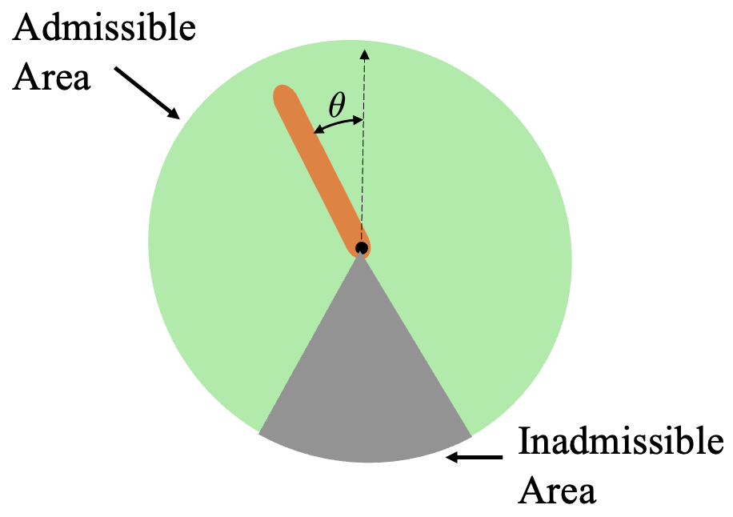
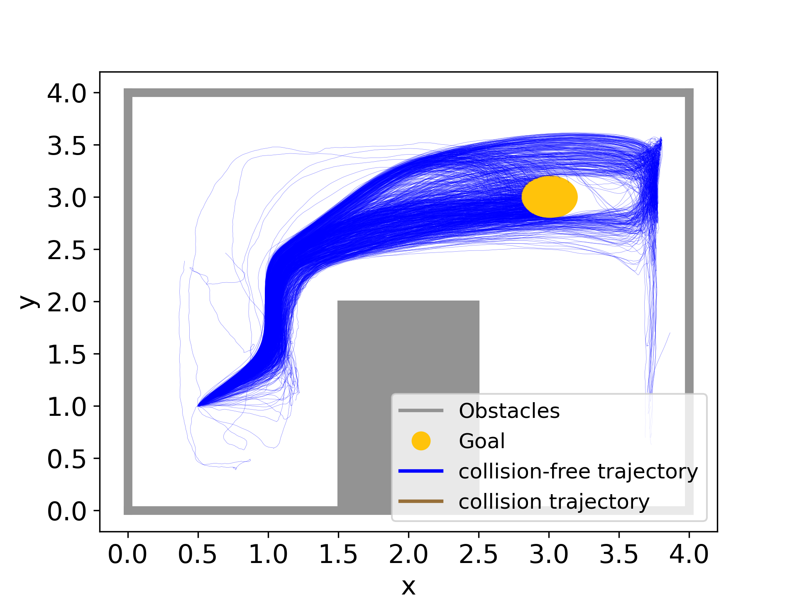

# Simultaneous Synthesis and Verification of Neural Control Barrier Functions

Implementation of the Branch-and-Bound Verification-in-the-Loop Training (BBVT) scheme for Neural Control Barrier Functions, as presented in our ECC 2024 paper titled ["Simultaneous Synthesis and Verification of Neural Control Barrier Functions through Branch-and-Bound Verification-in-the-Loop Training"](https://arxiv.org/pdf/2311.10438.pdf).

[](https://arxiv.org/pdf/2311.10438.pdf)

Control Barrier Functions (CBFs) that provide formal safety guarantees have been widely used for safetycritical systems. However, it is non-trivial to design a CBF. Utilizing neural networks (NNs) as CBFs has shown great success,
but it necessitates their certification as CBFs. In this work, we leverage bound propagation techniques and the Branchand-Bound scheme to efficiently verify that a NN satisfies the conditions to be a CBF over the continuous state space. To accelerate training, we further present a framework that embeds the verification scheme into the training loop to synthesize and verify a neural CBF (nCBF) simultaneously. In particular, we employ the verification scheme to identify partitions of the state space that are not guaranteed to satisfy the CBF conditions and expand the training dataset by incorporating additional data from these partitions. The NN is then optimized using the augmented dataset to meet the CBF conditions. We show that for a non-linear control-affine system, our framework can efficiently certify a NN as a CBF and render a larger safe set than state-of-the-art nCBF works. We further employ our learned nCBF to derive a safe controller to illustrate the practical use of our framework.

<div style="text-align:center;">

</div>

## Install

#### Create a conda environment
```bash
conda create --name <your_env_name> python=3.7

conda activate <your_env_name>
```

#### Install dependencies
```
pip install torch==1.11.0+cu113 torchvision==0.12.0+cu113 torchaudio==0.11.0 --extra-index-url https://download.pytorch.org/whl/cu113

pip install lightning==1.9.5 stable-baselines3==1.8.0

pip install termcolor scipy matplotlib cvxpy cvxpylayers gurobipy gymnasium tensorboard==2.11.2 pygame pymunk
```

#### Install this repo

```bash
git clone https://github.com/tud-amr/ncbf-simultaneous-synthesis-and-verification.git

cd ncbf-simultaneous-synthesis-and-verification

python -m pip install -e .
```

## Replicate the Results

### Inverted Pendulum (Assessing the Verification Efficiency and the Size of the Safe Set)

<div style="text-align:center;">

</div>

0. Configuration

    The configuration files are in *safe_rl_cbf/Configure*

1. Train the nCBF

    ```bash
    python3 safe_rl_cbf/main/train_model.py --config_file inverted_pendulum.json
    ```

2. Test the nCBF (replicate Fig. 4 )

    ```bash
    python3 safe_rl_cbf/main/test_model.py --config_file inverted_pendulum.json
    ```

    Figures can be found in *logs/CBF_logs/\<prefix\>/fig*

3. Safe Policy Learning 

    Training
    ```bash
    python3 safe_rl_cbf/RL/main/train_model.py --config_file inverted_pendulum.json
    ```

    Visualization
    ```bash
    python3 safe_rl_cbf/RL/main/test_model.py --config_file inverted_pendulum.json
    ```

### 2D Navigation (Combine learned nCBF with Reinforcement Learning)

<div style="text-align:center;">

</div>

1. Train nCBF

    ```bash
    python3 safe_rl_cbf/main/train_model.py --config_file point_robot.json
    ```

2. Test nCBF (replicate Fig. 6d)

    ```bash
    python3 safe_rl_cbf/main/test_model.py --config_file point_robot.json
    ```

3. Safe Policy Learning (replicate Fig. 6a and Fig. 6b)

    Training
    ```bash
    python3 safe_rl_cbf/RL/main/train_model.py --config_file point_robot.json
    ```

    Visualization
    ```bash
    python3 safe_rl_cbf/Analysis/draw_training_trajectory.py

    python3 safe_rl_cbf/RL/main/test_model.py --config_file point_robot.json
    ```

## Understanding Our Code
The structure of the code is similar to our system diagram, shown above.

1. Branch-and-Bound Verification-in-the-Loop Training (BBVT)
  
    There is a class named BBVT, which manages the different modules to complete the training and verification process. The definition can be found in:  

    ```
    safe_rl_cbf/Models/BBVT.py
    ```

2. Learner

    The *Learner* stores the training and testing data in *DataModule* and optimizes the neural network through a Pytorch model, named *NeuralCBF*.

    The *Learner* is defined in:
    ```
    safe_rl_cbf/Models/Learner.py
    ```

    The *DataModule* is defined in: 
    ```
    safe_rl_cbf/Dataset/TrainingDataModule.py
    ```

    The *NeuralCBF* is defined in: 
    ```
    safe_rl_cbf/Models/NeuralCBF.py
    ```

3. Verifier

    The *Verifier* checks if the Control Barrier Conditions hold in each hyperrectangles. If not, those hyperrectangles will be refined.

    The *Verifier* is defined in: 
    ```
    safe_rl_cbf/Models/Verifier.py
    ```

    The computation of function Eq. 7 and Eq. 14a can be found in:
    ```
    safe_rl_cbf/Models/NeuralCBF.py#L159
    ```

    The Hyperrectangle refinement is defined in:
    ```
    safe_rl_cbf/Models/Verifier.py#L67
    ```

## Troubleshooting
If you run into problems of any kind, do not hesitate to [open an issue](https://github.com/tud-amr/ncbf-simultaneous-synthesis-and-verification/issues) on this repository.

